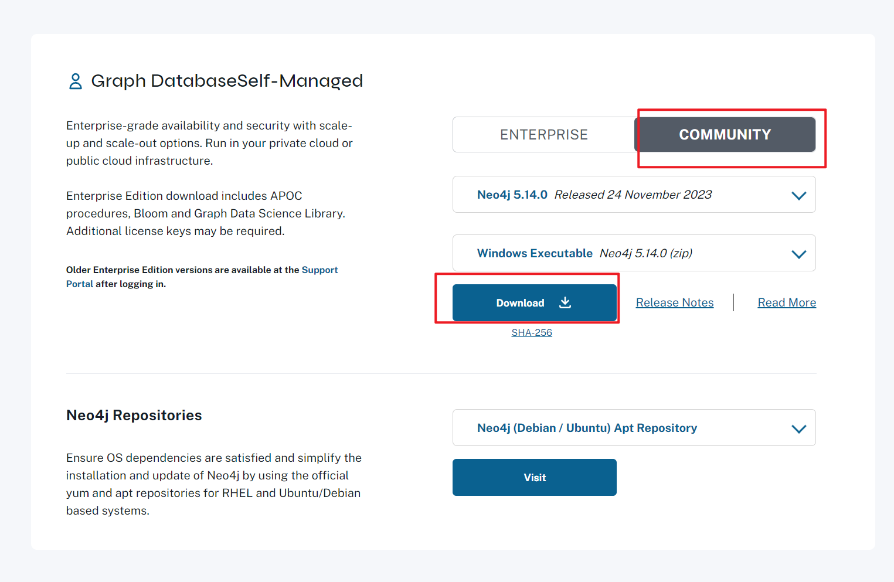
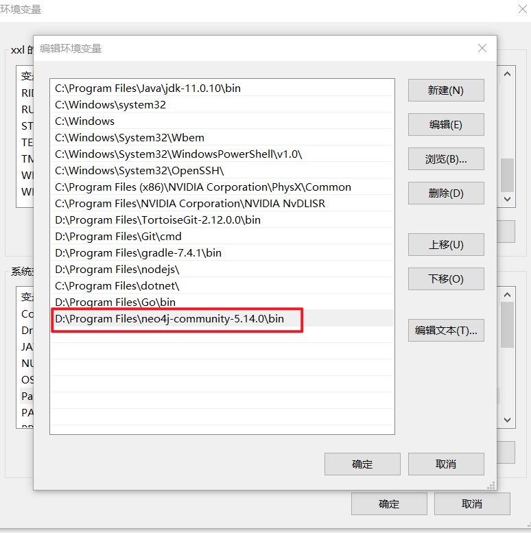
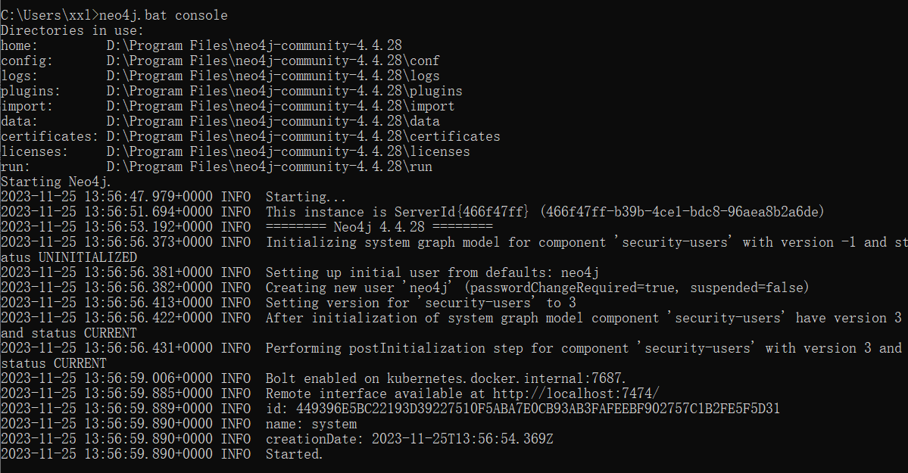
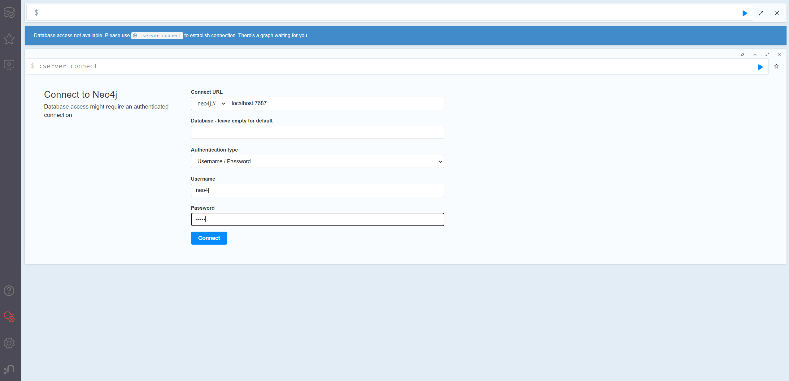
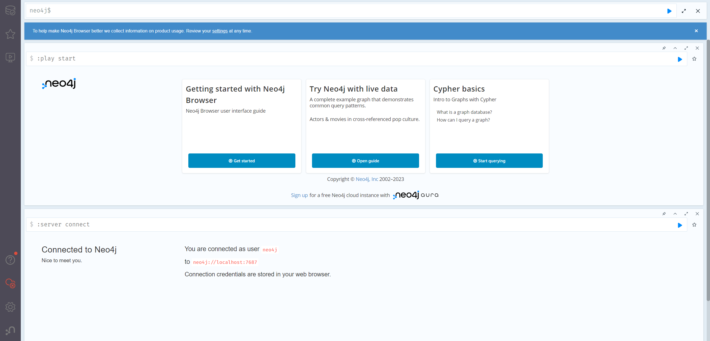

## Neo4j安装部署

Neo4j是基于Java的图形数据库，运行Neo4j需要启动JVM进程，因此在安装Neo4j前必须安装JAVA SE的JDK。

注意查看Neo4j详情页中与JDK版本对应。5点几版本需要JDK21。

### JDK安装

从Oracle官方网站下载Java SE JDK，地址为：https://www.oracle.com/cn/java/technologies/javase-downloads.html

### Neo4j安装

#### 1、下载

> 官网下载地址：https://neo4j.com/download-center/#community

进入官网，选择社区版下载

#### 2、解压安装包

Neo4j应用程序有如下主要的目录结构：

| **文件夹名称** | **相关说明**                |
| -------------- | --------------------------- |
| bin            | 存放Neo4j的可执行程序       |
| conf           | 存放Neo4j启动的相关配置文件 |
| data           | 存放Neo4j数据库的核心文件   |
| lib            | 存放Neo4j所依赖的jar包      |
| logs           | 存放Neo4j的日志文件         |
| plugins        | 存放Neo4j的插件             |

#### 3、配置环境变量

将下载的压缩文件解压到系统合适的位置后

需要**创建**用户主目录环境变量`NEO4J_HOME`，变量值设置为解压后的主目录路径。

**编辑**系统变量区的**Path**，点击新建，然后输入 **%NEO4J_HOME%\bin**

或者

直接在系统变量Path中新建解压后的bin目录路径。

#### 4、其他配置

Neo4j的配置文件存储在conf目录下，Neo4j通过配置文件neo4j.conf控制服务器的工作。默认情况下，不需要进行任意配置，就可以启动服务器。

Neo4j的核心数据文件默认存储在data/graph.db目录中，要改变默认的存储目录，可以在配置选项更新。下面的代码展示了限定文件存储在data/graph.db目录中的指令。
dbms.active_database=graph.db
•数据库的安全验证默认是启用的，可以从配置选项中停用该内容。以下代码表示安全验证不启用。

dbms.security.auth_enabled=false
•在配置选项中还可以配置Java堆内存的大小。下列代码分别是配置Java堆内存的最大值和最小值。

dbms.memory.heap.initial_size=512m
dbms.memory.heap.max_size=512m

### 启动neo4j

以系统用户身份，通过命令行**neo4j.bat console**运行Neo4j。

显示started即为完成。

Neo4j服务器具有一个集成的浏览器，在一个运行的服务器实例上访问`http://localhost:7474/`，打开浏览器，显示启动页面。

默认的用户名和密码均为**neo4j**

登录后需重置密码（至少八位）

Neo4j-web UI界面

https://blog.csdn.net/sinat_20471177/article/details/131943497