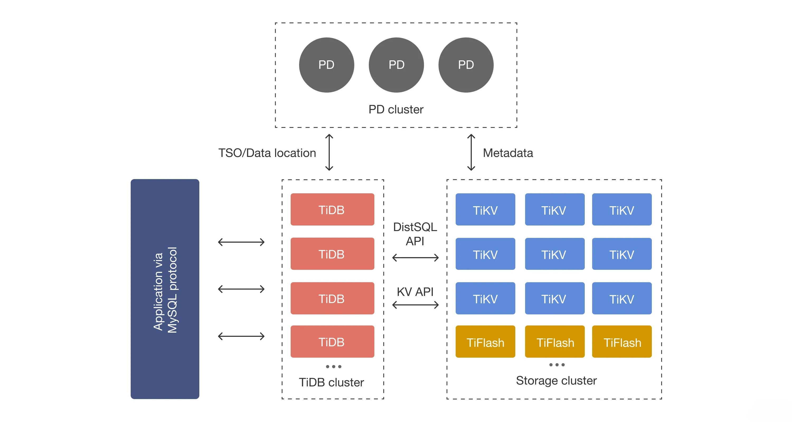

## 一、需求分析

随着业务规‍模持续扩大，数据越来越‌多，我们会发现系统面临‍着几个关键挑战：

- 传统MySQL单机部署的存储容量和性能已经难以满足不断增长的用户和内容需求，而数据库分库分表又有较高的研发和运维成本。
- 业务中经常需要跨表查询和修改，如点赞后内容计数表，分库分表后事务一致性难以保证。
- 数据库扩容、分片再平衡、备份恢复等运维工作复杂，系统的水平扩展能力也受到严重限制。

为解决上述‍问题，我们需要引入一‌种既能保持关系型数据‍库的 ACID 特性‍，又能实现水平扩展的‍分布式数据库解决方案。

## 二、TiDB 介绍

我们使用 TiDB 来替代 MySQL。

[TiDB](https://github.com/pingcap/tidb) 是 [PingCAP](https://pingcap.com/about-cn/) 公司自主设计、研发的 **开源** 分布式关系型数据库，是一款同时支持在线事务处理与在线分析处理 (Hybrid Transactional and Analytical Processing, HTAP) 的融合型分布式数据库产品，具备水平扩容或者缩容、金融级高可用、实时 HTAP、云原生的分布式数据库、兼容 MySQL 协议和 MySQL 生态等重要特性。目标是为用户提供一站式 OLTP (Online Transactional Processing)、OLAP (Online Analytical Processing)、HTAP 解决方案。TiDB 适合高可用、强一致要求较高、数据规模较大等各种应用场景。

五大核心特性（简单了解即可）：

- 一键水平扩缩容：得益于 TiDB 存储计算分离的架构的设计，可按需对计算、存储分别进行在线扩容或者缩容，扩容或者缩容过程中对应用运维人员透明。
- 金融级高可用：数据采用多副本存储，数据副本通过 Multi-Raft 协议同步事务日志，多数派写入成功事务才能提交，确保数据强一致性且少数副本发生故障时不影响数据的可用性。可按需配置副本地理位置、副本数量等策略，满足不同容灾级别的要求。
- 实时 HTAP：提供行存储引擎 [TiKV](https://docs.pingcap.com/zh/tidb/stable/tikv-overview/)、列存储引擎 [TiFlash](https://docs.pingcap.com/zh/tidb/stable/tiflash-overview/) 两款存储引擎，TiFlash 通过 Multi-Raft Learner 协议实时从 TiKV 复制数据，确保行存储引擎 TiKV 和列存储引擎 TiFlash 之间的数据强一致。TiKV、TiFlash 可按需部署在不同的机器，解决 HTAP 资源隔离的问题。
- 云原生的分布式数据库：专为云而设计的分布式数据库，通过 [TiDB Operator](https://docs.pingcap.com/zh/tidb-in-kubernetes/stable/tidb-operator-overview) 可在公有云、私有云、混合云中实现部署工具化、自动化。
- 兼容 MySQL 协议和 MySQL 生态：兼容 MySQL 协议、MySQL 常用的功能、MySQL 生态，应用无需或者修改少量代码即可从 MySQL 迁移到 TiDB。提供丰富的[数据迁移工具](https://docs.pingcap.com/zh/tidb/stable/ecosystem-tool-user-guide/)帮助应用便捷完成数据迁移。

它很适合本项目的海量数据及高并发的 OLTP 场景，因为传统的单机数据库无法满足因数据爆炸性的增长对数据库的容量要求。TiDB 是一种性价比高的解决方案，采用计算、存储分离的架构，可对计算、存储分别进行扩缩容，计算最大支持 512 节点，每个节点最大支持 1000 并发，集群容量最大支持 PB 级别。

TiDB 核心组件，对存储架构感兴趣的同学了解下：

1）[TiDB Server](https://docs.pingcap.com/zh/tidb/stable/tidb-computing/)：SQL 层，对外暴露 MySQL 协议的连接 endpoint，负责接受客户端的连接，执行 SQL 解析和优化，最终生成分布式执行计划。TiDB 层本身是无状态的，实践中可以启动多个 TiDB 实例，通过负载均衡组件（如 TiProxy、LVS、HAProxy、ProxySQL 或 F5）对外提供统一的接入地址，客户端的连接可以均匀地分摊在多个 TiDB 实例上以达到负载均衡的效果。TiDB Server 本身并不存储数据，只是解析 SQL，将实际的数据读取请求转发给底层的存储节点 TiKV（或 TiFlash）。

2）[PD (Placement Driver) Server](https://docs.pingcap.com/zh/tidb/stable/tidb-scheduling/)：整个 TiDB 集群的元信息管理模块，负责存储每个 TiKV 节点实时的数据分布情况和集群的整体拓扑结构，提供 TiDB Dashboard 管控界面，并为分布式事务分配事务 ID。PD 不仅存储元信息，同时还会根据 TiKV 节点实时上报的数据分布状态，下发数据调度命令给具体的 TiKV 节点，可以说是整个集群的“大脑”。此外，PD 本身也是由至少 3 个节点构成，拥有高可用的能力。建议部署奇数个 PD 节点。

3）存储节点

- [TiKV Server](https://docs.pingcap.com/zh/tidb/stable/tidb-storage/)：负责存储数据，从外部看 TiKV 是一个分布式的提供事务的 Key-Value 存储引擎。存储数据的基本单位是 Region，每个 Region 负责存储一个 Key Range（从 StartKey 到 EndKey 的左闭右开区间）的数据，每个 TiKV 节点会负责多个 Region。TiKV 的 API 在 KV 键值对层面提供对分布式事务的原生支持，默认提供了 SI (Snapshot Isolation) 的隔离级别，这也是 TiDB 在 SQL 层面支持分布式事务的核心。TiDB 的 SQL 层做完 SQL 解析后，会将 SQL 的执行计划转换为对 TiKV API 的实际调用。所以，数据都存储在 TiKV 中。另外，TiKV 中的数据都会自动维护多副本（默认为三副本），天然支持高可用和自动故障转移。
- [TiFlash](https://docs.pingcap.com/zh/tidb/stable/tiflash-overview/)：TiFlash 是一类特殊的存储节点。和普通 TiKV 节点不一样的是，在 TiFlash 内部，数据是以列式的形式进行存储，主要的功能是为分析型的场景加速。

架构图如下：

## 三、参考资料

[1]. https://blog.csdn.net/wt334502157/article/details/126468893

[2]. https://www.cnblogs.com/jiamiing/p/18891454