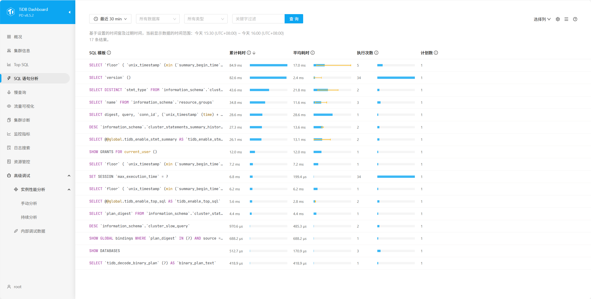

> 注意，TiDB 仅支持 mac 和 Linux ，windows 可以使用虚拟机来安装。

最基础的 TiDB 测试集群通常由 2 个 TiDB 实例、3 个 TiKV 实例、3 个 PD 实例和可选的 TiFlash 实例构成。通过 TiUP Playground，可以快速搭建出上述的一套基础测试集群，各实例的作用：

- TiDB Server：负责SQL解析和请求处理
- PD Server：确保调度中心高可用
- TiKV Server：数据分片存储
- TiFlash：用于分析查询加速

安装迁移步骤如下：

## 一、安装 TiUP

系统环境

~~~
系统：OpenEuler-25.03
~~~

下载并安装 TiUP：

~~~sh
curl --proto '=https' --tlsv1.2 -sSf https://tiup-mirrors.pingcap.com/install.sh | sh
~~~

安装成功后会出现提示信息：


记得执行一下 source 命令，让变量和设置在当前命令行中立即生效：

```Bash
source ${your_shell_profile}
```

## 二、启动并创建集群

执行启动命令时，每次重新执行命令会得到一个全新的集群，所以我们需要带上 --tag 参数来持久化数据：

```Bash
tiup playground --tag thumb
```

出现以下提示，即是启动成功了：


根据提示访问 http://127.0.0.1:2379/dashboard，就能看到 TiDB 的面板了：


默认账号为root，密码为空；

同时部署的Grafana账号密码为（admin/admin）



这个面板可以用于监控数据库的 QPS、延迟、CPU、内存等核心数据、各个节点的运行状况、慢查询等信息，排查数据库问题的时候非常有用~

## 三、数据迁移

现在 TiDB 已经成功启动了，接下来就是将 MySQL 的数据迁移到 TiDB。TiDB 的迁移相关内容可以参考文档：[数据迁移概述](https://docs.pingcap.com/zh/tidb/stable/migration-overview/)。

在实际生产中，官方的建议是使用 TiDB DM（适合小数据量，例如 1 TB 以内）和 TiDB Lightning（大数据量）进行数据迁移。

💡 如果在生产环境中遇到数据迁移的需求，一定要有完善的流程和策略，举个例子：

1. 全量数据同步：使用 TiDB DM 工具进行初始数据迁移
2. 增量数据同步：配置 MySQL Binlog 到TiDB的实时同步
3. 双写验证阶段：应用同时写入 MySQL 和TiDB，比对数据一致性
4. 切换读流量：将读请求切换到 TiDB
5. 切换写流量：确认无问题后，将写请求切换到 TiDB
6. 下线旧MySQL：完成迁移后，逐步下线 MySQL 实例

不过项目的数据量远远达不到 TB 级别，同时只需要一次全量同步即可。而且上述的两种方式都比较麻烦，所以可以直接用 SQL 文件的方式迁移数据。

### 1、导出原始数据

首先将 MySQL 中的数据导出：


### 2、创建 TiDB 数据库并导入


手动创建数据库 后，执行刚刚导出的 SQL 文件：


这样，我们就完成了数据从 MySQL 到 TiDB 的迁移。由于 TiDB 兼容 MySQL 协议，所以不需要改动业务代码，需要更改 yml 文件中的 `spring.datasource.url` 即可，如果没有给 TiDB 设置密码等安全配置，记得要把 `spring.datasource.password` 留空。

### 3、更改链接配置

将 yml 文件中，数据库的配置修改为：

```YAML
spring:  
  datasource:  
    url: jdbc:mysql://localhost:4000/thumb_db  
    username: root  
    password:
```

### 4、测试

启动项目，访问点赞接口测试一下，TiDB 里已经新增了一条记录：


这样，迁移就完成了，可以自行测试一下迁移前后的性能对比。

## 四、问题

### 问题一：TiDB 部署之后，Windows 无法本地访问远程 TiDB

#### 方法一：

直接在启动命令之后加 `-host 0.0.0.0`，完整命令如下：

~~~
tiup playground --tag thumb --host 0.0.0.0
~~~

执行命令之后，看到下图就算成功了


#### 方法二

1）修改配置

打开指定的配置文件 `/root/.tiup/data/thumb/tidb-0/tidb.toml`，找到 `[server]` 部分，并将 `host` 修改为 `0.0.0.0`：

~~~sh
[server]
host = "0.0.0.0"
port = 4000
~~~

如果没有 `[server]` 部分，可以直接添加上述内容。

2）重启TiDB服务

由于你使用的是 `tiup` 管理 TiDB，可以通过 `tiup` 命令重启服务：

```sh
tiup cluster restart <cluster-name>
```

如果不确定集群名称，可以先列出所有集群：

```sh
tiup cluster list
```

然后使用正确的集群名称重启服务。

3）验证监听状态

重启后，再次检查 TiDB 是否监听了 0.0.0.0:4000：

~~~sh
netstat -tuln | grep 4000
~~~

正确的输出应该是：

~~~sh
tcp        0      0 0.0.0.0:4000          0.0.0.0:*               LISTEN
~~~

